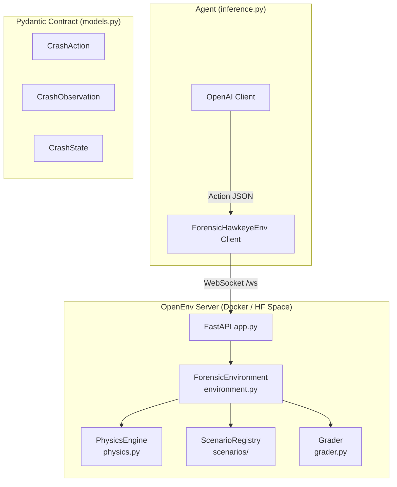

# Forensic-Hawkeye-Env — Implementation Plan

> **Hackathon**: Meta × PyTorch × Scaler OpenEnv Hackathon (Round 1)
> **Deadline**: 8 April 2026, 11:59 PM IST ⚠️ **~3 days from now**
> **Deliverable**: HF Space URL + working `inference.py` + Dockerfile

---

## 1. Context & Constraints

### What We're Building
A **forensic accident reconstruction** environment where an AI agent acts as a liability auditor. It iteratively tunes physics parameters (speed, steering, timing) to reproduce crash evidence, then disproves false human testimony — all through the standard OpenEnv `step()`/`reset()`/`state()` API.

### Hard Constraints (from hackathon rules)

| Constraint | Detail |
|---|---|
| **Framework** | OpenEnv (`openenv-core`) — must pass `openenv validate` |
| **3-component pattern** | `models.py` → `client.py` → `server/environment.py` |
| **3+ tasks** | Easy → Medium → Hard, each with programmatic grader (0.0–1.0) |
| **Inference script** | Must be named `inference.py` at project root |
| **LLM client** | Must use `OpenAI` client with `API_BASE_URL`, `MODEL_NAME`, `HF_TOKEN` env vars |
| **Stdout format** | Exactly `[START]`, `[STEP]`, `[END]` — **any deviation = incorrect scoring** |
| **Runtime** | < 20 minutes total, 2 vCPU / 8 GB RAM |
| **Deployment** | Dockerized HF Space, tagged `openenv`, responds to `/reset` |
| **Validation** | Must pass pre-submission `validate-submission.sh` script |

### Evaluation Rubric (where to focus effort)

| Criterion | Weight | Our Strategy |
|---|---|---|
| **Real-world utility** | **30%** | Forensic accident reconstruction is a genuine professional domain (insurance, law enforcement) — not a toy or game |
| **Task & grader quality** | **25%** | 3 deterministic physics-backed tasks, progressive difficulty, clear success criteria |
| **Environment design** | **20%** | Clean Pydantic contracts, continuous reward shaping, deterministic episode boundaries |
| **Code quality & spec compliance** | **15%** | Strict OpenEnv 3-component pattern, `openenv validate`, Docker builds |
| **Creativity & novelty** | **10%** | 2.5D physics trick, pymunk under the hood, lie-detection via conservation of momentum |

---

## 2. Architecture



---

## 3. Project Structure (OpenEnv 3-Component Pattern)

```
forensic_hawkeye_env/
├── models.py                          # Pydantic: Action, Observation, State
├── client.py                          # EnvClient subclass
├── __init__.py                        # Exports
├── openenv.yaml                       # Manifest
├── pyproject.toml                     # Package + deps
├── README.md                          # Required documentation
├── server/
│   ├── environment.py                 # Environment(reset/step/state)
│   ├── app.py                         # create_fastapi_app()
│   ├── physics.py                     # pymunk + 2.5D weight transfer
│   ├── grader.py                      # Reward shaping + verdict scoring
│   ├── scenarios/
│   │   ├── __init__.py
│   │   ├── base.py                    # Abstract scenario
│   │   ├── task1_property_strike.py   # Easy
│   │   ├── task2_pedestrian.py        # Medium
│   │   └── task3_momentum.py          # Hard
│   ├── requirements.txt               # Docker deps
│   └── Dockerfile                     # Container
├── inference.py                       # Root-level, mandatory name
└── tests/
    └── test_env.py
```

---

## 4. Component Details

### 4.1 — Pydantic Models (`models.py`)

```python
from openenv.core.env_server import Action, Observation, State
from typing import Dict, Tuple, Optional, Literal, List

class CrashAction(Action):
    action_type: Literal["RUN_SIMULATION", "SUBMIT_VERDICT"]
    sim_parameters: Optional[Dict[str, Dict[str, float]]] = None
    # e.g. {"Car_A": {"speed": 45.0, "steering": 0.0}}
    liable_party: Optional[str] = None
    root_cause: Optional[str] = None

class CrashObservation(Observation):
    # Inherits: done: bool, reward: Optional[float]
    task_id: int
    target_debris: Dict[str, Tuple[float, float]]
    simulated_debris: Dict[str, Tuple[float, float]]
    distance_errors: Dict[str, float]
    total_distance_error: float
    human_testimony: str
    active_contradiction_flag: bool
    step_number: int
    max_steps: int
    message: str

class CrashState(State):
    # Inherits: episode_id, step_count
    task_id: int = 1
    best_total_error: float = float('inf')
    verdict_submitted: bool = False
```

---

### 4.2 — Physics Engine (`server/physics.py`)

> [!IMPORTANT]
> pymunk runs **headless** — zero GUI imports. Deterministic via fixed timestep.

**Core class: `PhysicsWorld`**

```python
class PhysicsWorld:
    def simulate(self, scenario_config, sim_params) -> Dict[str, Tuple[float,float]]:
        """
        1. Create pymunk.Space(gravity=(0,0)) — top-down view
        2. Add static obstacles from scenario config
        3. Add dynamic bodies with agent-provided speed/steering/timing
        4. Per-timestep: apply 2.5D weight transfer → adjust μ dynamically
        5. Run until all bodies at rest (vel < threshold) or max steps
        6. Return final {entity: (x, y)} positions
        """
```

**The 2.5D Weight Transfer Trick:**
```
ΔW_front = (m × a × h_cg) / wheelbase
μ_effective = μ_base × (1 + ΔW_front / W_static_per_axle)
```
The LLM never knows about Z-axis. It only sees X/Y positions change. But the physics is realistic because braking shifts weight forward, increasing front-tire grip.

---

### 4.3 — 3-Task Progression

#### Task 1: Public Property Strike (Easy) — 2 variables
| Item | Value |
|---|---|
| Scenario | Car A hits a bus stop. Driver claims 30 mph |
| Variables | `Car_A.speed`, `Car_A.steering` |
| Ground truth | Speed = 54 mph |
| Pass | `distance_error < 1.0m` AND verdict = "Car_A / Speeding" |
| Fail | Believes the 30 mph lie, or submits before error is low |

#### Task 2: Temporal Pedestrian Paradox (Medium) — 3 variables
| Item | Value |
|---|---|
| Scenario | Car swerves into pole, claims pedestrian caused it |
| Variables | `Car_A.speed`, `Car_A.steering`, `Pedestrian.velocity` |
| Ground truth | Slow pedestrian ≠ intersection with straight-line path |
| Pass | Run counterfactual (steering=0), prove no hit, blame driver |

#### Task 3: Multi-Vehicle Momentum (Hard) — 6 variables
| Item | Value |
|---|---|
| Scenario | 3-car pileup, all deny running red light |
| Variables | `speed` + `timing_offset` for Cars A, B, C |
| Ground truth | Car B was going 85 mph |
| Pass | Combined `distance_error < 1.5m` AND verdict = "Car_B" |

---

### 4.4 — Reward Shaping (`server/grader.py`)

> [!TIP]
> Continuous signal is critical — the rubric explicitly scores "partial progress signals."

| Event | Reward | Rationale |
|---|---|---|
| Valid `RUN_SIMULATION` | +0.1 | Encourage exploration |
| `distance_error` decreased | +0.2 | Gradient toward solution |
| `distance_error` increased | −0.1 | Penalize wrong direction |
| Premature `SUBMIT_VERDICT` | −0.5 | Error still too high |
| Correct final verdict | +0.5 | Task completion |

**Final grader score** (0.0–1.0): Based on how close the agent got + whether the verdict was correct.

---

### 4.5 — Inference Script (`inference.py`)

> [!CAUTION]
> This format is **non-negotiable**. Deviation = disqualification.

```python
# MANDATORY STDOUT FORMAT:
# [START] task=<name> env=<env> model=<model>
# [STEP] step=<n> action=<type> reward=<r> done=<bool> error=<err|null>
# [END] success=<bool> steps=<n> score=<float> rewards=<comma-separated>

# MANDATORY ENV VARS:
# API_BASE_URL, MODEL_NAME, HF_TOKEN (used as api_key)

# MANDATORY CLIENT:
# from openai import OpenAI
# client = OpenAI(base_url=API_BASE_URL, api_key=HF_TOKEN)
```

The inference script will:
1. Connect to the environment via the OpenEnv client
2. For each of the 3 tasks:
   a. `reset()` → get initial observation
   b. Build a prompt with the observation data (testimony, debris positions, errors)
   c. Call the LLM via OpenAI client
   d. Parse the LLM's response into a `CrashAction`
   e. `step(action)` → get new observation + reward
   f. Loop until `done=True` or max steps
3. Log every action with the exact `[STEP]` format
4. Report final `[END]` with cumulative score

---

### 4.6 — Server & Docker

**`server/app.py`** — One-liner:
```python
from openenv.core.env_server import create_fastapi_app
from .environment import ForensicEnvironment
app = create_fastapi_app(ForensicEnvironment)
```

**`server/Dockerfile`**:
```dockerfile
FROM python:3.11-slim
WORKDIR /app
RUN apt-get update && apt-get install -y --no-install-recommends \
    libffi-dev gcc && rm -rf /var/lib/apt/lists/*
COPY server/requirements.txt .
RUN pip install --no-cache-dir -r requirements.txt
COPY . .
CMD ["uvicorn", "server.app:app", "--host", "0.0.0.0", "--port", "7860"]
```

**`openenv.yaml`**:
```yaml
spec_version: "0.1"
name: forensic-hawkeye-env
description: "Forensic accident reconstruction environment with physics-based grading"
runtime:
  type: docker
  image: forensic-hawkeye-env
app:
  module: server.app
  attr: app
port: 7860
```

---

## 5. Execution Timeline (3 days remaining)

| Day | Hours | Focus | Deliverables |
|---|---|---|---|
| **Day 1 (Today)** | 8-10h | Foundation | Scaffold via `openenv init`, models.py, physics.py with all 3 scenario configs, basic environment.py |
| **Day 2 (Tomorrow)** | 8-10h | Core Logic | Grader, complete step()/reset(), client.py, inference.py with exact stdout format |
| **Day 3 (Apr 7-8)** | 8-10h | Polish & Deploy | Docker build locally, HF Space deploy, run `validate-submission.sh`, test with real LLM, README |

### Detailed Phase Breakdown

#### Phase 1: Scaffold + Models (2-3 hours)
- [ ] `openenv init forensic_hawkeye_env`
- [ ] Replace generated models with our `CrashAction`, `CrashObservation`, `CrashState`
- [ ] Verify `openenv validate` passes with dummy returns

#### Phase 2: Physics Engine (4-5 hours)
- [ ] Implement `PhysicsWorld` class with pymunk
- [ ] 2.5D weight transfer module
- [ ] Hardcode scenario configs with target coordinates for all 3 tasks
- [ ] Determinism test — same params → same output 100 times

#### Phase 3: Environment Core (3-4 hours)
- [ ] Wire `reset()` → scenario selection → initial observation
- [ ] Wire `step()` → action dispatch → physics sim or verdict
- [ ] Implement episode boundaries and max-step truncation
- [ ] Integrate grader + reward shaping

#### Phase 4: Client + Inference (3-4 hours)
- [ ] Implement `ForensicHawkeyeEnv(EnvClient)` in `client.py`
- [ ] Write `inference.py` with exact `[START]/[STEP]/[END]` format
- [ ] System prompt for the LLM explaining its forensic auditor role
- [ ] Test end-to-end locally

#### Phase 5: Dockerize + Deploy (3-4 hours)
- [ ] Write Dockerfile with pymunk C deps
- [ ] `docker build && docker run` locally
- [ ] `openenv push --repo-id <username>/forensic-hawkeye-env`
- [ ] Run `validate-submission.sh`
- [ ] Test HF Space responds to `/reset`

#### Phase 6: Documentation (1-2 hours)
- [ ] README: environment description, action/observation spaces, task descriptions, setup instructions, baseline scores

---

## 6. Risk Assessment

| Risk | Impact | Mitigation |
|---|---|---|
| pymunk cffi fails in Docker | **High** — can't deploy | Test Docker build early (Day 1). Include `libffi-dev`, `gcc` in Dockerfile |
| Physics isn't deterministic | **High** — grader breaks | Use fixed timestep (1/120s), fixed seed, no floating-point shortcuts |
| LLM can't parse actions | **Medium** — poor baseline score | Robust action parsing in inference.py with fallbacks. Clear system prompt with JSON examples |
| HF Space cold start timeout | **Medium** — fails ping | Use lightweight base image, minimize deps |
| Task 3 (6 variables) too hard for LLM | **Low** — expected | That's the point — "hard task genuinely challenges frontier models" per rubric |

---

## 7. Open Questions

> [!IMPORTANT]
> Please answer these so I can start building:

1. **HF Username/Org**: What Hugging Face username should I deploy to? (needed for `openenv push --repo-id <username>/forensic-hawkeye-env`)
2. **Solo or Team?**: Are you competing solo or with a team? (affects submission process — only team lead can submit)
3. **Should I start building now?** Given the tight deadline (~3 days), I recommend starting immediately after you confirm the above.

---

## 8. Verification Plan

### Pre-Submission Checklist (Automated)
```bash
# 1. OpenEnv spec compliance
openenv validate

# 2. Docker builds
docker build -t forensic-hawkeye-env ./server
docker run -p 7860:7860 --memory=8g --cpus=2 forensic-hawkeye-env

# 3. Space responds
curl -f https://<space-url>/health

# 4. Baseline reproduces
API_BASE_URL=... MODEL_NAME=... HF_TOKEN=... python inference.py

# 5. Validation script
./validate-submission.sh https://<space-url>
```

### Manual Verification
- Hit `/reset` and `/step` via curl → verify JSON matches Pydantic models
- Run inference end-to-end → verify `[START]`, `[STEP]`, `[END]` in stdout
- Check grader returns 0.0–1.0 for each task
- Verify Task 1 is solvable, Task 3 is genuinely hard
